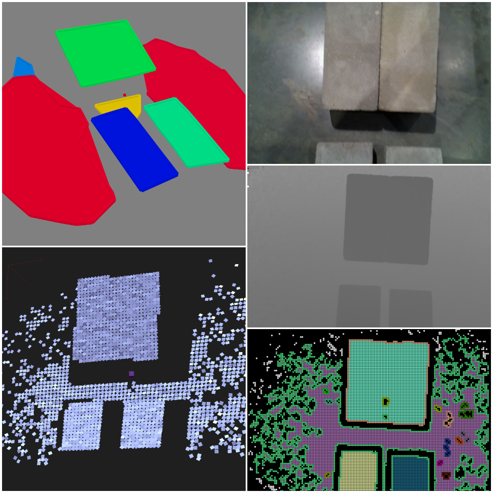

# MapSenseROS

## Description

MapSense is a fast perception algorithm for extracting a map of the world for various applications including robotics and augmented reality. 
Planar regions are abundantly available in most indoor and urban environment settings. 
The current project aims to provide a fast planar region extraction algorithm for footstep planning on legged robots. 
The MapSense algorithm uses OpenCL to perform GPU-accelerated planar region detection and extraction from depth images.
It can be used with any off-the-shelve depth image sensor. Some examples include RealSense L515, RealSense D435, Microsoft Kinect, and others.

 

## Getting Started

### Using Docker

This project comes with a pre-packaged Docker container with all necessary dependencies for the algorithm to run.
This Docker image can be either built locally, or pulled from the Docker Hub.

#### Host Dependencies

The only dependencies that need to be manually installed includes nvidia-docker2 and docker itself. 
Use the following commands to install them on the host.

```
distribution=$(. /etc/os-release;echo $ID$VERSION_ID) \
   && curl -s -L https://nvidia.github.io/nvidia-docker/gpgkey | sudo apt-key add - \
   && curl -s -L https://nvidia.github.io/nvidia-docker/$distribution/nvidia-docker.list | sudo tee /etc/apt/sources.list.d/nvidia-docker.list

sudo apt-get update -y
sudo apt-get install -y nvidia-docker2
sudo systemctl restart docker
```
The next step is to get the docker image for the container either from Docker Hub or built locally.
Use the following commands based on preference. 

#### Docker Hub

```
bash Docker/runRemoveMapSense.sh
```

#### Local Build

```
cd Docker
mkdir -p Shared_Volume #Volume mapping to share ROSBags for testing MapSense inside the container.
docker build -t bmishra/mapsense-nvidia-ros .
```

## Using Own Depth CameraParams

For using MapSense with a depth camera, simply direct the `camera_info` and `depth` topics to the appropriate input topics.

## Using Provided ROS Bag

```
rosbag play --loop L515_MotionCinderBlocks.bag
```

## Input Topics

```
/camera/depth/camera_info
/camera/depth/image_rect_raw
```

## Output Topics

```
/mapsense/planar_regionsd
```

## Configuration Parameters

```
Input Resolution: (width, height)
Filter, Pack, Merge Kernels: (thread_pool_width, thread_pool_height)
Patch Angular Merge Threshold
Patch Distance Merge Threshold
```